<div align="center">
  
</div>

<br>

## `$ whoami`

```console
pranav@snowrlax:~$ whoami
Backend-focused engineer building AI agent systems that actually ship.
2 yrs of production experience — agentic RAG chatbots, MCP servers,
LLM pipelines behind FastAPI microservices. I like clean APIs,
fast retrieval, and owning things end-to-end.
```

## `$ tree ~/stack`

```console
pranav@snowrlax:~$ tree ~/stack -L 1
stack/
├── languages/   python · typescript · java · sql
├── ai/          langchain · langgraph · rag · mcp-servers · chroma · huggingface
├── backend/     fastapi · django-rest · node · express · postgres · mongodb
├── frontend/    react · next.js · tailwind · framer-motion
└── infra/       docker · aws · gcp · github-actions · jenkins · grafana
```

## `$ ls ~/projects`

| | | |
|---|---|---|
| [`awesome-langgraphjs/`](https://github.com/snowrlax/awesome-langgraphjs) | 🦜🕸️ | Curated open-source LangGraph.js examples, projects & videos |
| [`the-last-pawn/`](https://github.com/snowrlax/the-last-pawn) | ♟️ | Minimalist chess-inspired survival game — React · Redux · Vite |
| [`giveittwominutes/`](https://github.com/snowrlax/giveittwominutes) | ⏱️ | Every good habit starts with 2 minutes |
| [`buildQuick/`](https://github.com/snowrlax/buildQuick) | 🔋 | Next.js template with batteries included |

## `$ git log --stat`

<div align="center">
  
  <br><br>
  
</div>

## `$ connect --with pranav`

```console
pranav@snowrlax:~$ connect --with pranav
  mail  →  sonawanepranav19@gmail.com
  web   →  https://pranavsonawane.com
  code  →  https://github.com/snowrlax
```

<br>

<div align="center">
  <sub><code>✻ Brewing… (esc to interrupt)</code></sub>
</div>
